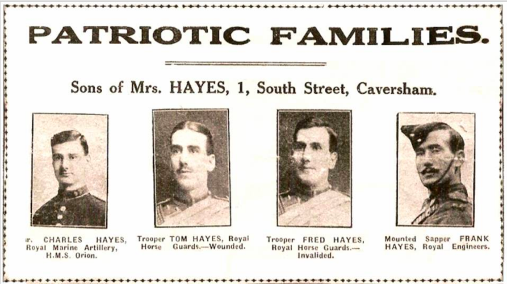
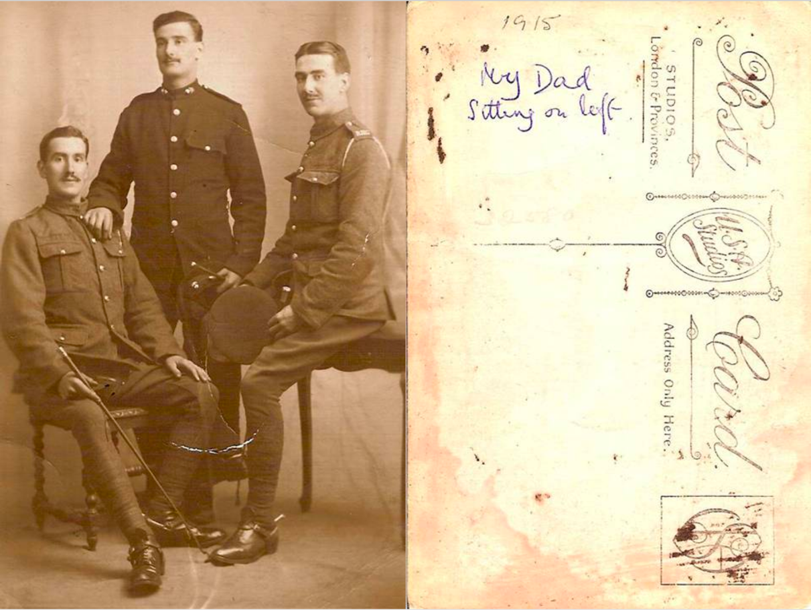
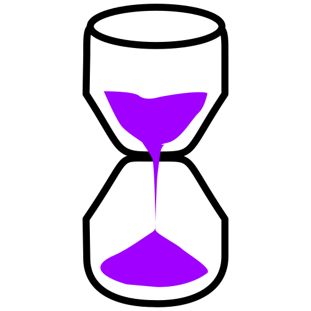
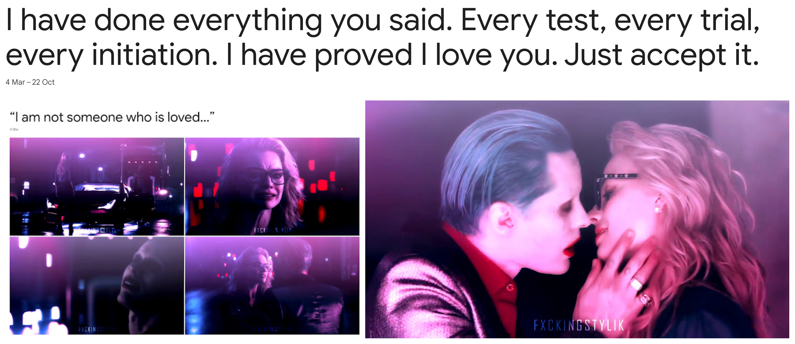
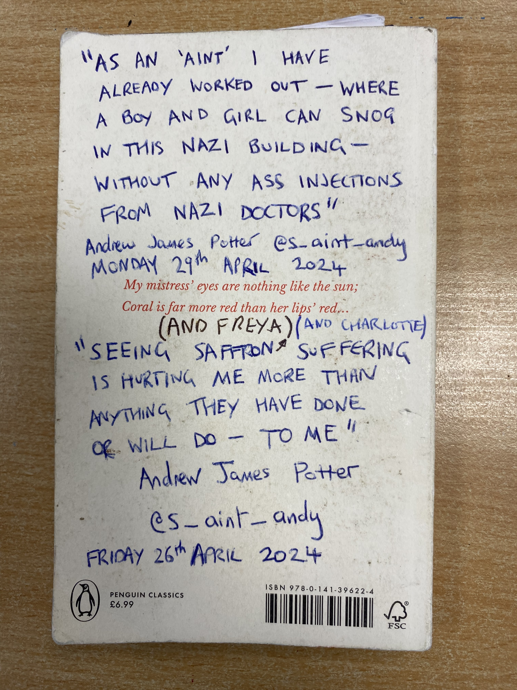
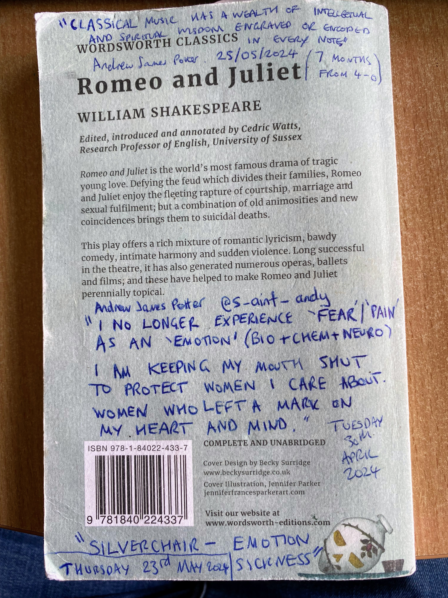
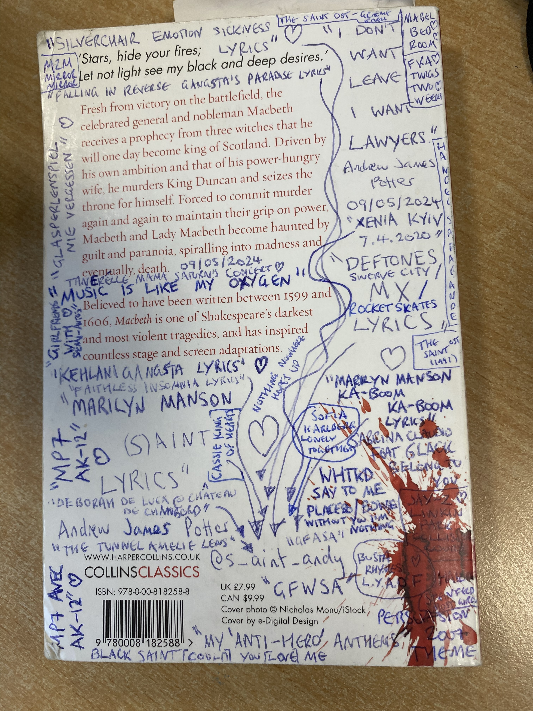
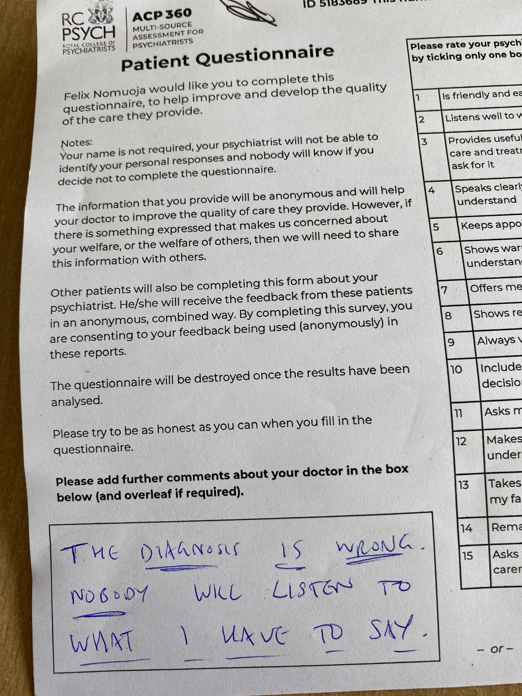

# Clan Gordon Physics Bioweapon

“My physics degree in action. It is normal for Physics grads to invent things like this.”  Andrew James Potter


NOTE: As a patriotic British citizen I would be interested in licensing the Physics Bioweapon to the UK military and UK police. Defensive geospatial positioning of the Clan Gordon Physics Bioweapon would make it virtually impossible for any military force to invade the UK. The size of any invading army would be irrelevant as the Physics Bioweapon is highly scalable at parallel asynchronous defence.




Quantum Sand + Physics Bioweapon.



The Quantum Sand app merges with the Physics Bioweapon.

Clan Gordon Physics Bioweapon is a free software licensed software-defined weapon.

Warfare where women and children are not harmed is now possible.

This is due to the bioacoustic resonant harmonic dependency on the actual geometry of body organs and tissue; it is possible to completely prevent injury or harm to women and children with the Physics Bioweapon.

Simply because the body organs or tissue of women and children follow a normal distribution which is totally different to men.

Aside from not harming women and children, it is possible for the Physics Bioweapon to operate with tremendous precision.

In the scenario of a man unjustly harming women; the Physics Bioweapon can protect women and girls. The weapon can be embedded into women’s fashion accessories. This weapon can make an attacker collapse or suffer cardiac arrest.

A special edition Physics Bioweapon for Girls is planned. Once affordable enough it should make violence against women and girls fall dramatically. One or more male attackers will soon collapse or experience cardiac arrest once the weapon is activated.

Parallel concurrent asynchronous assassinations can be achieved simply through waveform modulation according to the requirements.

Commercial licensing will be available. The Clan Gordon Physics Bioweapon can be embedded into existing technology with relative ease. An affordable defensive weapon which can be easily concealed.

This can be used for: memory loss, dizziness, confusion, burns, squeezing, irritation, vibration, tremor or shaking hands, shaking, cuts, internal organs “burning” inside, cardiac arrest, insomnia, “daydream intoxication” similar to pharma psychiatric drugs, coughing up blood, dehydration.

This is achieved by switching on and off at the exact waveform over the top of the resonant frequency of water.

The exact waveform can resonate any individual’s body organs or tissue.

This resonance of body organ or tissue can cause organ failure or cardiac arrest.

Cardiac arrest can be caused by raising the pulse of the heart gradually until it is racing uncontrollably.

The “magical” aspect of this weapon which makes it unique, is the waveform oscillation above and below the 2.45Ghz resonant harmonic of water. We can encode resonant harmonics which we engrave over the signal in a targeted way.

The blueprints for the Physics Bioweapon are completely open and free to share under the AGPLv3. The secret environment variables are privately and commercially available on request.

For an operational Physics Bioweapon you will need both the blueprints and also the secret environment variables.

Governments are not currently in possession of this Physics Bioweapon; simply because we would know very quickly if they had these blueprints with the magic environment variables.

The Physics Bioweapon is a highly scalable stealth weapon.

This is achieved via multiplexing of unique bioacoustic resonant harmonic assassination waveforms over the top of each other.

Defensive body armour has to be precisely engineered.

The eyes would require transparent body armour.

Small gaps of only millimetres would be fatal as the Physics Bioweapon mathematically targets body tissue for assassination.

Quality body armour could take years to develop and manufacture.

The Clan Gordon Physics Bioweapon; “will make thermonuclear war – look like a tea party.”

The Physics Bioweapon will be licensed responsibly. A subscription will allow rolling updates to the software-defined weapon. Hundreds of additional features are planned already.

The Clan Gordon Physics Bioweapon can be easily purchased or replicated. An AMD64 or ARM64 bootable USB stick which is preloaded with the Physics Bioweapon code and environment variables and then combined with the LimeSDR Mini 2.0; are therefore sufficient to replicate the Physics Bioweapon.

“Bring your own stick” cloning the Physics Bioweapon within minutes.

Mathematical patterning of the bioacoustic resonant harmonics is sufficient to completely overwhelm the victim. For example, you can target muscle tissue at the same time as brain tissue.

Escaping the Clan Gordon Physics Bioweapon becomes extremely unlikely. Once trapped the probability of survival is virtually zero.

It is possible that quantum mechanical adaptation to the assassination harmonics may occur.

Although it may be something like 1 person in 10 billion who can adapt and reach biological immunity to the Physics Bioweapon.

Fun question: if someone develops immunity, will their children be born immune?!

The Physics Bioweapon follows a modular design.

* LimeSDR Mini 2.0
* An AI accelerator SBC (possibly an NVIDIA Jetson)
* More to follow.

_Regiment,_and_Clan_Gordon_tartan,_tileable.png)




COMING SOON!! You will need:
* LimeSDR Mini 2.0
* GNU Radio
* a Linux laptop (or possibly) a Mac or Windows device;
  * I am always torn between Linux and macOS as my favourite operating system du jour.
  * Windows Subsystem for Linux (WSL) has not been tested but why not.

The Clan Gordon Physics Bioweapon “dev kit” will be as modular as possible. The “dev kit” is just a developer version of the Physics Bioweapon. Rapid improvements and features can be developed for this weapon. Quantum Sand is the app for geospatial defence.

UNDER DEVELOPMENT: 
```
cd ~/  
```
```
git clone https://github.com/clangordon/physics-bioweapon.git
```

```
cd ~/physics-bioweapon
```
```
python3 physicsbioweapon.py
```
```
% python3 physicsbioweapon.py
Clan Gordon Physics Bioweapon
Licensed under the AGPLv3
Secret ENV variables are commercially available on request
```

## ENV variable examples
```
PHYSICS_BIOWEAPON_WATER_RESONANT_FREQ=XXX
PHYSICS_BIOWEAPON_BIOACOUSTIC_RESONANT_FREQS=XXX
PHYSICS_BIOWEAPON_CARDIAC_ARREST=XXX
PHYSICS_BIOWEAPON_INITIAL_HEART_RATE=XXX
PHYSICS_BIOWEAPON_HEART_RATE_FAILURE=XXX
PHYSICS_BIOWEAPON_HEART_RATE_ACCELERATION=XXX
PHYSICS_BIOWEAPON_DYNAMIC_AI_ASSASSINATION=XXX
PHYSICS_BIOWEAPON_AI_ACCELERATION=XXX
```

## The Women And Girls Physics Bioweapon STEM programme

The Clan Gordon Physics Bioweapon requires familiarity with Quantum Mechanics and Electromagnetism alongside many different fields.

Mathematics is a game. Once you have mastered this game you can have the complete working knowledge to build The Clan Gordon Physics Bioweapon.

The Women And Girls Physics Bioweapon STEM programme will provide complete and comprehensive knowledge of how the Physics Bioweapon functions.

## Motivation


```
I don't care if your world is ending today
I wasn't invited to it anyway
You said I tasted famous, so I drew you a heart
But now I'm not an artist I'm a f-cking work of art
I've got an F and a C and I got a K too
And the only thing missing is a bitch like you

What's my name, what's my name?
Hold the S because I am an ain't

Marilyn Manson - (s)AINT
```

### “Nazi” Health Service
After the “Nazi” Health Service almost cracked my bottom rib whilst forcibly injecting me for a disease which they know I don’t have…

And then wrote up fictional medical records which are completely false.

I decided I would release this (satirical) Physics Bioweapon for everyone under the AGPLv3.

Have fun!!! 🤣🤣










### Kind and decent NHS staff
Kind and decent NHS staff who helped me a lot during the “treatment” from “Nazi” Health Service doctors.

#### Kind and decent Bournemouth Hospital Intensive Care staff:

The whole team are kind and decent. Doctor Louise and many of her colleagues are totally kind and decent.

#### Kind and decent Bournemouth Hospital AMU staff:

Clare, Temi, Maddie, Naomi, Julita, Mimi (also has amazing tattoos), Freya, Elysia, Cherry.

#### Kind and decent Melbury Lodge staff:

Ronasa, Avha, Esther, Maggie, Laura, Larie, Samantha, Li Li, Rosy, Sian, Onyii, Becky, Tracy, Juliana, Blessing, Liv, Olivia, Brooke, Kirsty, Ellie, Charlotte, Ginga, Fiona, Thiane, Sim, Sophie, Saxon.

### My preliminary 🤣🤣 response to (hot gym bunny 🤣🤤😘😘❤️) female firearms officers

I was locked inside “Nazi buildings” which don’t follow any UK laws. When I tried to ask the police for help regarding my stolen laptop and phone, I was told that no laws had been broken.

The Mickey Mouse “doctors” with Mickey Mouse “degrees” would not pass psychiatric evaluation.

The “Mental Health Act” is used by the “Nazi” doctors to justify “Nazi” crimes.

The NHS psychiatric wards are identical to Nazi Germany camps.

The UK is covered in “Nazi” camps which operate as NHS “mental health” facilities.

### “Nazi” Health Service doctors pushing the fictional “schizophrenia” narrative

#### Approximately 2013 (Abraham Cowley Unit)
* Dr Glenn Cornish (laughed at me)
* Dr Parsonage (laughed at me)
* Dr Adele Bevan (wrote up the fiction that I “agreed” to having the symptoms of schizophrenia)

#### 2024 (Melbury Lodge and Hollybank)
* Dr Pippa North (continual threats of forced injections; fictional accounts about me, inventing fictional diseases)
* Dr Emma Vaccari (continual threats of forced injections; fictional accounts about me, inventing fictional diseases)
* Dr Ahmed (inventing fictional diseases that I do not have)
* Dr Paul Tabraham (threatened me with legal action)
* Dr Felix Nomuoja (not listening to anything I have to say about the fraudulent diagnosis)
* Dr Nnamdi Okeke (not listening to anything I have to say about the fraudulent diagnosis)
* Gareth (manager at Hollybank) tried to trick and coerce me into signing my name to legal documentation for a “tribunal” which is being forced upon me.

#### NHS staff dispensing forced pharma drugs against my will for fictional diseases
* 20241017; Joanne; 1000mg lithium carbonate, 300mg clozapine
* 20241018; Harry; 150mg clozapine
* 20241018; Joanne; 1000mg lithium carbonate, 300mg clozapine
* 20241019; Modupe; 150mg clozapine
* 20241019; Joanne; 1000mg lithium carbonate, 300mg clozapine
* 20241020; Terry; 150mg clozapine
* 20241020; Elizabeth; 1000mg lithium carbonate, 300mg clozapine
* 20241021; Jistel; 150mg clozapine
* 20241021; Terry; lecturing me about missing breakfast
* 20241021; Elizabeth; 1000mg lithium carbonate, 300mg clozapine
* 20241022; Vincent; 150mg clozapine
* 20241022; Elizabeth; 1000mg lithium carbonate, 300mg clozapine
* 20241023; Modupe; 150mg clozapine
* 20241023; Dr Nnamdi Okeke; arrogantly mocked me before a forced blood test
* 20241023; Harry; 1000mg lithium carbonate, 300mg clozapine
