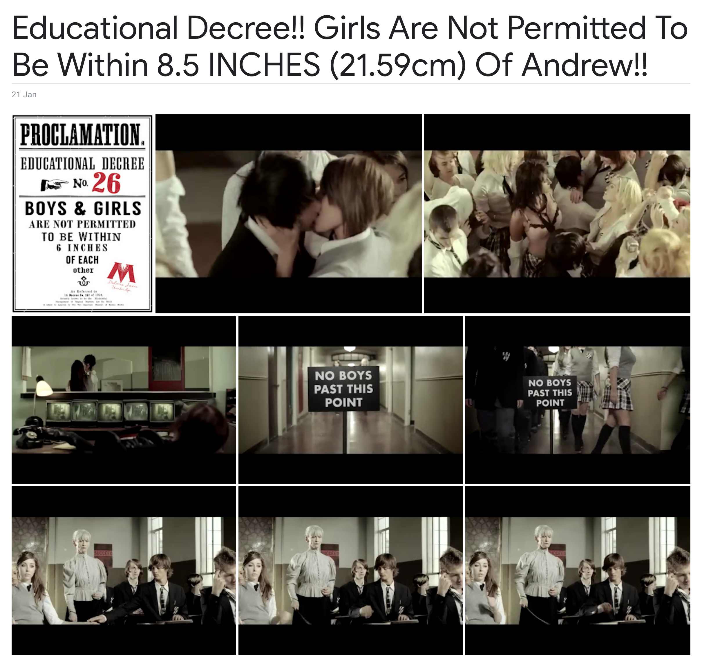

# Clan Gordon Physics Bioweapon

Clan Gordon Physics Bioweapon is a free software licensed software-defined weapon.

Commercial licensing will be available. The Clan Gordon Physics Bioweapon can be embedded into existing technology with relative ease. An affordable defensive weapon which can be easily concealed.





COMING SOON!! You will need:
* a software-defined radio (covering 2.45Ghz)
* GNU Radio
* a Linux laptop

UNDER DEVELOPMENT: 
```
cd ~/  
```
```
git clone https://github.com/clangordon/physics-bioweapon.git
```

```
cd ~/physics-bioweapon
```
```
python3 physicsbioweapon.py
```
```
% python3 physicsbioweapon.py
Clan Gordon Physics Bioweapon
Licensed under the AGPLv3
Secret ENV variables are commercially available on request
```

## ENV variable examples
```
PHYSICS_BIOWEAPON_WATER_RESONANT_FREQ=XXX
PHYSICS_BIOWEAPON_BIOACOUSTIC_RESONANT_FREQS=XXX
PHYSICS_BIOWEAPON_CARDIAC_ARREST=XXX
```

Copyright (C) 2021-2024 Andrew James Potter.
